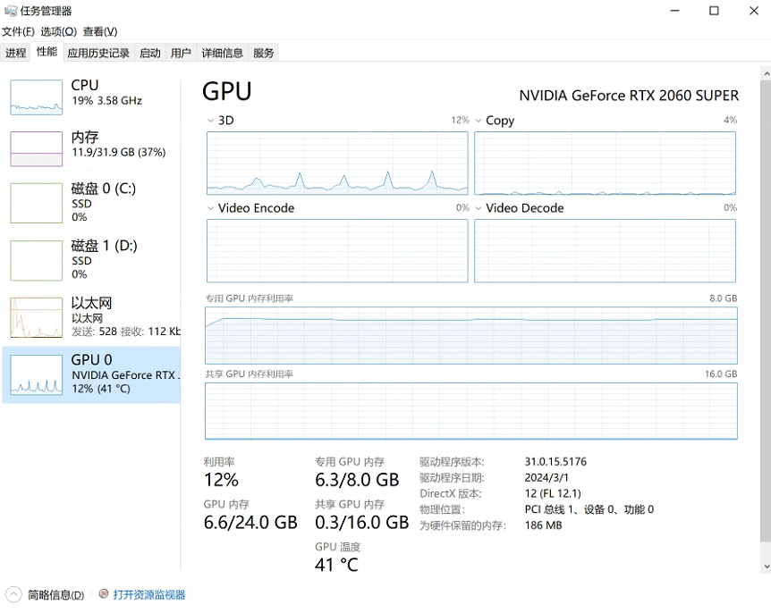

## 使用cpu  

用时：13min30s


```
Epoch: 1, Train_acc:70.4%, Train_loss:0.857, Test_acc:65.8%，Test_loss:0.842
Epoch: 2, Train_acc:80.8%, Train_loss:0.597, Test_acc:77.8%，Test_loss:0.498
Epoch: 3, Train_acc:84.3%, Train_loss:0.496, Test_acc:86.7%，Test_loss:0.448
Epoch: 4, Train_acc:87.6%, Train_loss:0.451, Test_acc:85.8%，Test_loss:0.485
Epoch: 5, Train_acc:88.1%, Train_loss:0.393, Test_acc:84.4%，Test_loss:0.389
Epoch: 6, Train_acc:88.7%, Train_loss:0.390, Test_acc:84.9%，Test_loss:0.362
Epoch: 7, Train_acc:90.1%, Train_loss:0.337, Test_acc:89.8%，Test_loss:0.374
Epoch: 8, Train_acc:91.1%, Train_loss:0.338, Test_acc:85.8%，Test_loss:0.385
Epoch: 9, Train_acc:91.3%, Train_loss:0.330, Test_acc:88.0%，Test_loss:0.294
Epoch:10, Train_acc:92.3%, Train_loss:0.273, Test_acc:90.2%，Test_loss:0.303
Epoch:11, Train_acc:91.7%, Train_loss:0.280, Test_acc:91.1%，Test_loss:0.268
Epoch:12, Train_acc:93.3%, Train_loss:0.290, Test_acc:85.8%，Test_loss:0.489
Epoch:13, Train_acc:92.4%, Train_loss:0.294, Test_acc:90.2%，Test_loss:0.271
Epoch:14, Train_acc:92.4%, Train_loss:0.262, Test_acc:91.6%，Test_loss:0.263
Epoch:15, Train_acc:93.7%, Train_loss:0.223, Test_acc:90.2%，Test_loss:0.438
Epoch:16, Train_acc:94.4%, Train_loss:0.221, Test_acc:90.2%，Test_loss:0.269
Epoch:17, Train_acc:93.9%, Train_loss:0.209, Test_acc:90.2%，Test_loss:0.273
Epoch:18, Train_acc:94.7%, Train_loss:0.223, Test_acc:89.8%，Test_loss:0.284
Epoch:19, Train_acc:94.6%, Train_loss:0.196, Test_acc:88.0%，Test_loss:0.243
Epoch:20, Train_acc:94.8%, Train_loss:0.189, Test_acc:91.1%，Test_loss:0.242
Done
```


## 使用gpu

用时：3min20s

```
Epoch: 1, Train_acc:60.2%, Train_loss:1.046, Test_acc:57.8%，Test_loss:1.116
Epoch: 2, Train_acc:78.3%, Train_loss:0.750, Test_acc:74.7%，Test_loss:0.761
Epoch: 3, Train_acc:81.7%, Train_loss:0.589, Test_acc:81.3%，Test_loss:0.550
Epoch: 4, Train_acc:85.3%, Train_loss:0.521, Test_acc:79.6%，Test_loss:0.557
Epoch: 5, Train_acc:86.3%, Train_loss:0.455, Test_acc:80.9%，Test_loss:0.458
Epoch: 6, Train_acc:87.0%, Train_loss:0.421, Test_acc:79.6%，Test_loss:0.474
Epoch: 7, Train_acc:88.4%, Train_loss:0.396, Test_acc:83.6%，Test_loss:0.429
Epoch: 8, Train_acc:90.7%, Train_loss:0.357, Test_acc:82.2%，Test_loss:0.406
Epoch: 9, Train_acc:90.1%, Train_loss:0.348, Test_acc:82.2%，Test_loss:0.667
Epoch:10, Train_acc:91.2%, Train_loss:0.331, Test_acc:85.8%，Test_loss:0.389
Epoch:11, Train_acc:91.7%, Train_loss:0.316, Test_acc:84.0%，Test_loss:0.401
Epoch:12, Train_acc:92.1%, Train_loss:0.302, Test_acc:87.1%，Test_loss:0.444
Epoch:13, Train_acc:92.1%, Train_loss:0.284, Test_acc:84.0%，Test_loss:0.378
Epoch:14, Train_acc:92.8%, Train_loss:0.267, Test_acc:86.7%，Test_loss:0.780
Epoch:15, Train_acc:93.9%, Train_loss:0.262, Test_acc:87.1%，Test_loss:0.348
Epoch:16, Train_acc:93.6%, Train_loss:0.253, Test_acc:86.2%，Test_loss:0.321
Epoch:17, Train_acc:94.4%, Train_loss:0.221, Test_acc:87.1%，Test_loss:0.357
Epoch:18, Train_acc:94.2%, Train_loss:0.254, Test_acc:86.7%，Test_loss:0.442
Epoch:19, Train_acc:95.3%, Train_loss:0.212, Test_acc:85.3%，Test_loss:0.689
Epoch:20, Train_acc:95.2%, Train_loss:0.215, Test_acc:81.8%，Test_loss:0.558
Done
```





